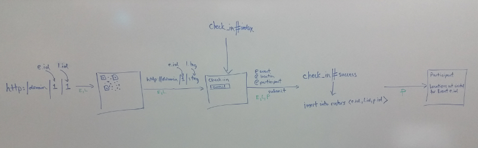

# CS 270 - Spring 2015 - QR Code Scavenger Hunt - Phase 6

In this final phase of the project, we will bring together all of the
infrastructure we have created thus far to produce a working example of
a scavenger hunt.

At the core of what we want to do is to facilitate a check-in pipeline
that allows a participant to scan a QR code, input their credentials,
and update their list of locations still to visit.

The pipeline, therefore, will look like this:

1. Generate the QR code on the Location show page
2. Scan the QR code
3. Redirect to input page
4. Input participant credentials
5. Add the location to the participant list of locations
6. Redirect to participant show page, and
7. Display locations still to visit for each participant event

One thing to note before leaping in is that this entire process occurs
within a certain context, namely, all of this happens under the auspices
of a particular event.  So, we need to keep track of at least event
information throughout the pipeline, and as we will see other
information as well.

One other thing to note is that the logical assumption to make is that
when an event is created, the event manager will most likely assign
participants and locations to that event as well.  Thus, we update our
seeds.rb file to associate Events/Locations and Events/Participants:

```
# associate Events and Locations as follows
# event_id | location_id
# ----------------------
#     1          1
#     1          2
Event.find(1).locations << Location.find(1)
Event.find(1).locations << Location.find(2)

# associate Events and Participants as follows
# event_id | participant_id
# -------------------------
#     1            1
#     1            2
Event.find(1).participants << Participant.find(1)
Event.find(1).participants << Participant.find(2)
```

Reset the database, and we are ready to go!

## Updating Routes and QR Code

The pipeline will look like this:



Because we need to keep track of event information, we start by
modifying the location show page URL to contain an event id, in the form
`http://domain/locations/event_id/location_id`.  This necessitates a
routing update in config/routes.rb:

`get 'locations/:event_id/:tag' => 'locations#show'`

Now we need to pass that same information when we scan the QR code and
redirect to the participant input page.  We incorporate that into our QR
code object when we generate the QR code URL:

```
@event = Event.find(params[:event_id])
@qr = RQRCode::QRCode.new("http://#{request.host}/#{@event.id}#{@location.tag}", :size => 8)
```

## Participant input page

But where will we redirect to when we scan a QR code?  The easiest
solution is to create a separate controller that handles the check-in
processing.  In this case, when we scan a QR code, we want to redirect
to a page that has a URL of the form
`http://domain/event_id/location_tag`.  We will map this route to an
index action inside this separate controller, which we will call the
CheckIn controller:

`get '/:event_id/:tag' => 'check_in#index'`

This obviously necessitates creating the actual controller:

`rails g controller check_in index success`

We will use the success action in just a moment to handle processing
when we click "submit" on the input page.

Now, we need to keep track of not only event information, but also
location information.  We can do so by instantiating an event object and
a location object using the parameters we passed in via the URL:

```
def index
  @event = Event.find(params[:event_id])
  @location = Location.find_by(tag: params[:tag])
end
```

This allows us to use those values in the input form.  The input form is
generated from the index.html.erb file in the newly create check_in view
folder, and for our purposes will simply contain a field to type in a
participant email.  It should look like this:

```
<h1>Check in for Location <%= @location.id %></h1>

<%= form_tag('/success') do %>
  <div class="field">
    <%= label_tag :email %><br>
    <%= text_field_tag :email %>
  </div>

  <%= hidden_field_tag :location_id, @location.id %>
  <%= hidden_field_tag :event_id, @event.id %>

  <div class="actions">
    <%= submit_tag "Check in" %>
  </div>
<% end %>
```

Notice that the action that is triggered upon submit is the `/success`
action...

So this time, we need to add a route for the success action.  Since we are
visiting the `/success` URL and passing parameters via the POST method,
we need this:

`post '/success' => 'check_in#success'`

## Check-in Processing

But what are we going to do when a participant actually checks in?
Basically, we need to add that location to the participant list of
visited locations.

Recall we previously set up a has_many/through relationship between the
Participant model and Location model.  Here is where we utlize that
model.  The result of that infrastructure was to create a separate join
model called Roster, which mapped events, locations, and participants
together in a single table.

In other words, we are going to add a new triple as a row to the rosters
table that looks like `<event_id, location_id, participant_id>`.  It now
becomes apparent why we were keeping track of certain information
throughout this process.  On the input page, we had tracked event and
location information, which we retained through the use of the hidden
form fields; when the participant input their email, we now had the
missing third piece with which to complete the check-in pipeline.

So, we simply want to create a new Roster entity in the database during
execution of the success action:

```
def success
  @event = Event.find(params[:event_id])
  @location = Location.find(params[:location_id])
  @participant = Participant.find_by(email: params[:email])

  respond_to do |format|
    if Roster.create(event_id: @event.id, location_id: @location.id, participant_id: @participant.id)
      format.html { redirect_to participant_path(id: @participant.id, event_id: @event.id), 
  	notice: 'Participant was successfully checked in.' }
      format.json { render :show, status: :updated, participant: @participant }
    else
      format.html { render :new }
      format.json { render json: @participant.errors, status: :unprocessable_entity }
    end
  end
end
```

Notice we still keep track of all our information at the beginning of
the success action, but that is really just for record keeping purposes
in the participant show page.  The real work is being done in the
Roster.create call...

## Updating the Participant show page

Notice that if we successfully create a new Roster row in the database,
we redirect to the participant show page.  We need to update that page
to list all unvisited locations for each event that participant is a
part of.  I will not post the verbatim code here (you will figure it
out), but the general algorithm for doing so as discussed in class is:

```
for each event in the participant
  for each location in that event
    if that location is not in the participant's location list
        display it on the page
```

## For Further Consideration

As we close out this project, there are still some areas for improvement to continue this work.

- add user account/authentication
- set up manager/participant-only roles for users
- link locations to a third-party map service
- add styling to the front-end
- consider type of database underlying project (currently, sqlite3. perhaps mysql?)

All these items are good areas for further study.
